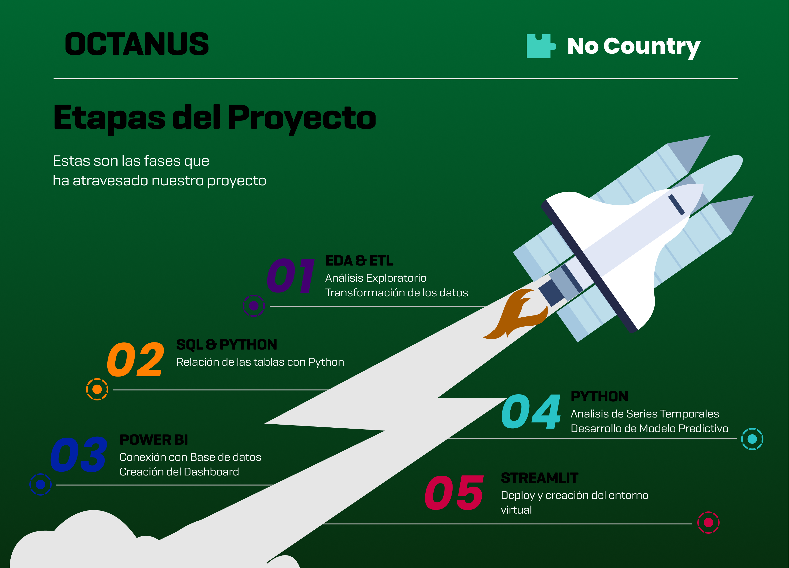
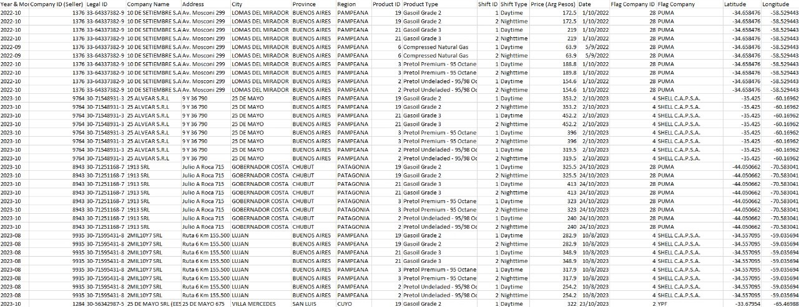

<h3><b>¡Bienvenid@s al repositorio del grupo 24 del seleccionado 14 de No Country! </b></h3>
 

El precio de los combustibles es esencial para la economía argentina, afectando aspectos como el costo de vida, la competitividad empresarial y la estabilidad macroeconómica. Nuestro proyecto de Business Intelligence (BI) busca ofrecer una plataforma completa para analizar y visualizar datos relacionados con los precios de los combustibles en Argentina desde el año 2001 a 2024. Utilizamos datos históricos para proporcionar información y herramientas analíticas a diversos stakeholders, entre ellos empresas energéticas, estaciones de servicio, reguladores gubernamentales, investigadores y ciudadanos. Nuestra plataforma ofrece visualización de tendencias, análisis comparativos, mapas e incluso analisis predictivos para diversas metricas. El objetivo es facilitar la toma de decisiones informadas, identificar oportunidades y riesgos, y comprender mejor los factores que influyen en el mercado de combustibles en Argentina, contribuyendo así al desarrollo de estrategias más eficientes y sostenibles en el sector energético.

 

****
 
<h3 align="center">🛠️ Miembros del Equipo</h3>

****
 

 
 
|Participantes|Roles|Redes|
|:---:|:---:|:---:|
|**Marcelo Peralta**|   |     |
|**Rodrigo Valdez**|   |     |
|**Hugo Terrile**||     |
|**Diego Sanabria**||     |
|**Leopoldo Flores**||     |
|**Franco Asplanatti**||     |
|**Juan Pablo Nieto**||     |

 

<h2>🚧 Stack de Tecnologías </h2>

<h2>🚩 User Stories:</h2>

1. Como analista de mercado, quiero poder visualizar gráficos que muestren la evolución histórica de los precios de los combustibles (nafta, gasoil, etc.) en Argentina durante los últimos años, para identificar tendencias y patrones.
2. Como inversor en el sector energético, quiero analizar la correlación entre los precios de los combustibles en Argentina y otros indicadores económicos clave, como el tipo de cambio o el precio del petróleo a nivel internacional, para tomar decisiones de inversión más fundamentadas.
3. Como gerente de una estación de servicio, quiero visualizar informes que me indiquen la variación porcentual del precio de los combustibles en comparación con periodos anteriores, para tomar decisiones informadas sobre la fijación de precios en mi establecimiento.
4. Como gerente de una estación de servicio, quiero recibir predicciones de la produccion de petroleo y gasoil, como asi tambien de los precios de los combustibles en Argentina para tomar decisiones informadas sobre la fijación de precios en mi establecimiento.

<h2>🚧 Producto mínimo viable (MVP):</h2>
 
El objetivo de este proyecto es que los usuarios puedan analizar y visualizar datos relacionados con los precios de los diferentes combustibles en Argentina desde el año 2001 a 2024. Con ello se pretende facilitar la toma de decisiones informadas, la identificación de oportunidades y riesgos, y proporcionar una comprensión más profunda de los factores que influyen en el mercado de combustibles en Argentina.
 
Con acceso a datos que abarcan un extenso período desde el año 2001 hasta el presente año 2024, los usuarios podrán realizar análisis retrospectivos detallados y examinar las tendencias a lo largo del tiempo. Esto les permitirá entender mejor cómo han evolucionado los precios de los combustibles en respuesta a cambios económicos, políticos y ambientales, así como identificar patrones estacionales o históricos que puedan influir en futuras decisiones.
 
Con este análisis en profundidad, los usuarios podrán anticipar tendencias futuras y tomar decisiones más fundamentadas para optimizar sus operaciones, minimizar riesgos y contribuir al desarrollo sostenible del sector energético argentino.
 

<h2>🚧 Etapas del Proyecto</h2>

<h2>🚧 Conclusiones</h2>

****
<h1 align='center' >Memoria del Proyecto</h1>
 
<h2 align='center' >✅ Sprint 0 ✅ </h2>
 

<h3>🚩 Creación del grupo de WhatsApp:</h3>

En el grupo de Slack se ha propuesto utilizar WhatsApp como nuestra principal herramienta de comunicación. Esta decisión se basa en las siguientes ventajas que ofrece:

<li>Comunicación directa: todos los integrantes tenemos esta herramienta en nuestros telefonos, lo cual permite una comunicación directa y continua. </li>
<li>Familiaridad: todos ya usamos esta App, lo que facilita la adopción de la nueva plataforma. </li>

<h3>🚩 Creación del canal de Discord:</h3>

En el grupo de WhatsApp se ha propuesto utilizar Discord como nuestra plataforma de comunicación secundaria. Esta decisión se basa en las siguientes ventajas que ofrece Discord:

<li>Compartir pantalla: ideal para colaborar en tareas que requieren visualización y edición conjunta de contenido. </li>
<li>Canales: facilita la organización y seguimiento de conversaciones temáticas, evitando la saturación en un único canal. </li>
<li>Familiaridad: la mayoría de nosotros ya conoce Discord, lo que facilita la adopción de la nueva plataforma. </li>

<h3>🚩 Definición de horario de reuniones diarias.</h3>
Hemos acordado que la reunión diaria se llevará a cabo todos los días a las 10:00 AM, hora de Argentina.
Durante estas reuniones diarias, cada miembro del equipo tendrá la oportunidad de compartir actualizaciones sobre su progreso, discutir posibles obstáculos y colaborar en soluciones. Se destacó la importancia de que todos participemos activamente y que mantengamos una actitud abierta y receptiva hacia las ideas de los demás.

<h3>🚩 Primeras ideas sobre proyectos.</h3>
En un principio, se consideraron diversas opciones, como Analisis del Mercado Inmobiliario, Analisis de Problematicas de Salud como Dengue, Analisis de Mercado de Combustibles, Analisis de Recursos Humanos, entre otras.

<h3>🚩 Recolección de diferentes Dataset.</h3>
Se propuso la busqueda de diferentes datasets para cada proyecto propuesto, esto con el fin de evaluar cuanta información se tenia de cada uno de ellos. Estos fueron detallados en un Excel donde cada integrante aportaba a cada uno de los proyectos la información correspondiente y agregando ademas que tipos de analisis podrian realizarse con ellos.
 

<h2 align='center' >✅ Sprint 1 ✅ </h2>

 
<h3>🚩 Elección del proyecto</h3>
Despues de haber reunido la información sobre los proyectos, se sometio la eleccion del mismo a votación, dando al proyecto de Analisis de Mercado de Combustibles el primer lugar.
 
Después de haber establecido el proyecto, el equipo se reunió para discutir varios aspectos, incluyendo el alcance, los objetivos, los requisitos y las metodologías. Tras esta revisión, comenzaron a trabajar en el proyecto. Durante las primera semana, se enfocaron en la planificación detallada de las tareas, asignando responsabilidades y estableciendo un cronograma claro. 
 
Durante este Sprint la tarea principal a completar es la limpieza del Dataset para poder trabajar con ella en las diferentes areas.
 
El equipo se comprometió a mantener una comunicación abierta y constante para garantizar un flujo de trabajo eficiente y colaborativo. A medida que avanzaban, surgieron desafíos que abordaron con creatividad y trabajo en equipo, demostrando su compromiso con el éxito del proyecto.
 
<h3>🚩 Definir User Stories:</h3>

1. Como analista de mercado, quiero poder visualizar gráficos que muestren la evolución histórica de los precios de los combustibles (nafta, gasoil, etc.) en Argentina durante los últimos años, para identificar tendencias y patrones..
2. Como inversor en el sector energético, quiero analizar la correlación entre los precios de los combustibles en Argentina y otros indicadores económicos clave, como el tipo de cambio o el precio del petróleo a nivel internacional, para tomar decisiones de inversión más fundamentadas.
3. Como gerente de una estación de servicio, quiero visualizar informes que me indiquen la variación porcentual del precio de los combustibles en comparación con periodos anteriores, para tomar decisiones informadas sobre la fijación de precios en mi establecimiento.
4. Como gerente de una estación de servicio, quiero recibir predicciones de la produccion de petroleo y gasoil, como asi tambien de los precios de los combustibles en Argentina para tomar decisiones informadas sobre la fijación de precios en mi establecimiento.
 

<h3>🚩 Primera extracción y limpieza de datos:</h3>
<h4>🚩 Dataset Challenge:</h4>

En primer instancia vamos a analizar un dataset corresponiente a un challenge que posee datos del mercado de combustibles de 2016 a 2023. Esto con el fin de poder avanzar con el proyecto identificando insights y datos importantes a agregar a nuestro estudio.

Estructura que tenia al inicio:

En el archivo [Limpieza de Datos Challenge](./base_de_datos/S14_24_Dataset_Challenge_Limpieza_y_Normalizado.ipynb) se puede ver todo el proceso de extracción y limpieza de este dataset.
O bien en el cuaderno virtual de Google Colab a continuación: [Limpieza de Dataset Challenge](https://colab.research.google.com/drive/1sKhEWzbkkvxeY-fy5MTZJ74Of6aM-9Sd?usp=sharing)

<h4>🚩 Dataset Ministerio de Energia:</h4>

Obtenemos los datos disponibles en el dataset extraido del ministerio de energia de la nacion Argentina.

En el archivo [Limpieza de Datos](./base_de_datos/Limpieza%20del%20Dataset.ipynb) se puede ver todo el proceso de extracción y limpieza de este dataset.

<h3>🚩 Creación de tablas y relaciones:</h3>
Mediante cambios en la estructura de los datos, se definieron distintas tablas en las que dividimos los registros, para su escalabilidad. De esta manera la base de datos no solo es más eficiente y optimiza el rendimiento, sino que permite hacer análisis más detallados de algunos puntos importantes.

 
<h3>🚩 Conexión de la base de datos a Power BI y primeros análisis</h3>

Con la conexión hecha con los archivos .csv se comenzó a analizar algunos insights en Power BI. Logrando asi desarrollar las primeras visualizaciones para el dashboard

<h2 align='center' >✅ Sprint 2 ✅ </h2>
 
<h3>🚩 Creación de Streamlit:</h3>

Streamlit es un marco de trabajo de Python de código abierto que te permite crear aplicaciones web personalizadas para el aprendizaje automático y la ciencia de datos. Con solo unas pocas líneas de código, podemos construir características interactivas que permiten a los usuarios manipular datos, ajustar parámetros y ver los resultados en tiempo real. Está diseñado para ayudar a los científicos de datos e ingenieros a optimizar sus procesos, desde la exploración de datos hasta la implementación de modelos.

Para nuestro proyecto Octanus se realizó la implementación en esta plataforma creando la estructura inicial en 4 partes:

1. Home: En esta se encuentra la descripción del proyecto, los objetivos, las fases del proyecto, los resultados y conclusiones.
2. Etapas de Desarrollo: Se muestra cómo se obtuvieron y cargaron los datos, así cómo el proceso de transformación y limpieza para tener las tablas que finalmente se utilizarán en el proyecto.
3. Visualización: En esta parte se muestra todo el análisis visual con los gráficos interactivos para hacer consultas y mirar la descripción de la data en múltiples combinaciones.
4. Predicciones: Se realizará la implementación del modelo de predicción final, donde el usuario podrá seleccionar el periodo de interés y el tipo de combustible, para obtener la predicción del precio del combustible a futuro.

Esta tarea será actualizada conforme avance el proyecto.

<h3>🚩 Division de Insights para el Dashboard:</h3>

Se analizó el dataset en el que se estaba trabajando para asi dividir y definir cuales serian los parametros y la información que se mostrará en el dashboard.

Se hizo la division en los siguientes campos:

1. Distribución de empresas en Argentina.
2. Analisis de precios por empresas.
3. Analisis de precios por tipo de combustible en pesos argentinos.
4. Analisis de precios por tipo de combustible en dolares.

<h3>🚩 Desarrollo de modelos predictivos:</h3>

En nuestra investigación, hemos empleado un modelo de regresión utilizando redes neuronales de la biblioteca TensorFlow para analizar la relación entre diversas variables y el precio del combustible. Estas variables incluyen el tipo de combustible, la ubicación geográfica, la fecha de registro (en formato Unix) y la tasa de cambio del dólar, tanto en el mercado oficial como en el mercado informal. Este enfoque nos ha permitido investigar cómo estas variables influyen en el precio del combustible y cómo este ha evolucionado con el tiempo.

En síntesis, el uso de este modelo nos ha proporcionado una comprensión más profunda de losfactores que afectan los precios del combustible,facilitando así la toma de decisionesfundamentadas en nuestro proyecto.

<h2 align='center' >✅ Sprint 3 ✅ </h2>
 
<h3>🚩 Creación de marca visual del proyecto:</h3>

En esta tarea definimos la paleta de colores que ibamos a implementar para la presentación del proyecto, se diseño tambien el logo del proyecto Octanus y a partir de este se comenzo a desarrollar el dashboard.

Con ello se unificará el diseño que se implementara en las diferentes herramientas utilizadas para nuestro proyecto como Streamlit, Power BI y tambien para desarrollar la visual del README.md

<h3>🚩 Corrección y ajuste de los modelos predictivos:</h3>

El ajuste de parámetros y variables en modelos predictivos es una etapa crucial para optimizar su rendimiento y obtener resultados más precisos y valiosos para el cliente. Este proceso implica modificar diversos aspectos del modelo con el objetivo de reducir el error y aumentar la confiabilidad de las predicciones.

Al ajustar cuidadosamente los parámetros y variables en un modelo predictivo, se puede lograr una mejora significativa en la precisión y confiabilidad de las predicciones. Esto puede generar resultados más valiosos para el cliente, ayudando a tomar mejores decisiones y obtener mejores resultados.

<h3>🚩 Ajustes en las visualizaciones de Power BI:</h3>

1. Revisión de la precisión y consistencia de los datos: Se verificó que los datos representados en las visualizaciones sean precisos y consistentes con las fuentes originales. Se corrigieron errores o inconsistencias identificadas.

2. Mejora de la claridad y legibilidad de las visualizaciones: Se ajustó el formato, la escala y el uso de colores en las visualizaciones para mejorar su claridad y legibilidad. Se aseguraron de que las etiquetas, leyendas y otros elementos textuales sean fáciles de leer y comprender.

3. Optimización del diseño y la distribución de las visualizaciones: Se reajustó la ubicación y el tamaño de las visualizaciones dentro del dashboard para optimizar su distribución y mejorar la experiencia visual del usuario. Se consideró el flujo de información y la jerarquía de las visualizaciones.

<h2 align='center' >✅ Sprint 4 ✅ </h2>
 
<h3>🚩 Actividades:</h3>